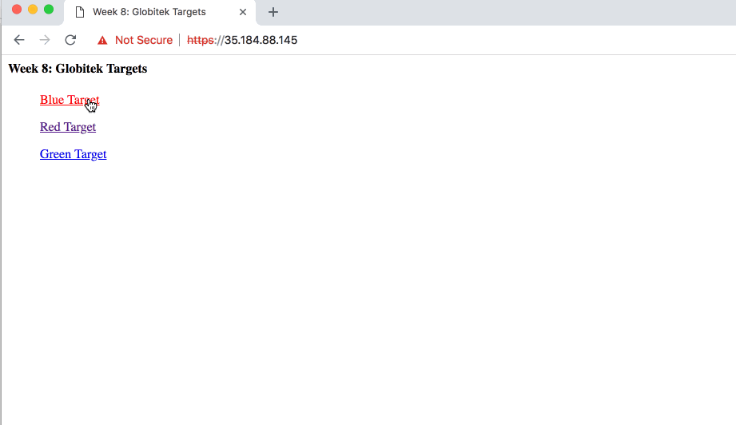
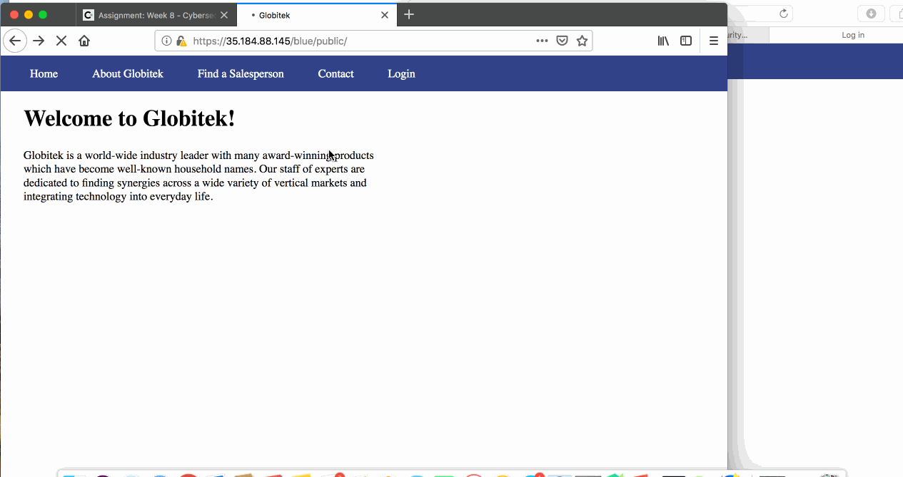
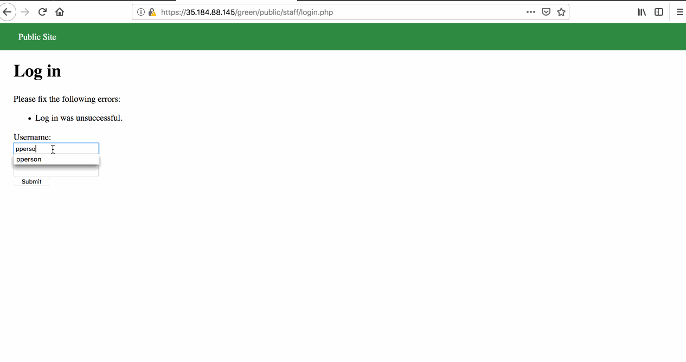
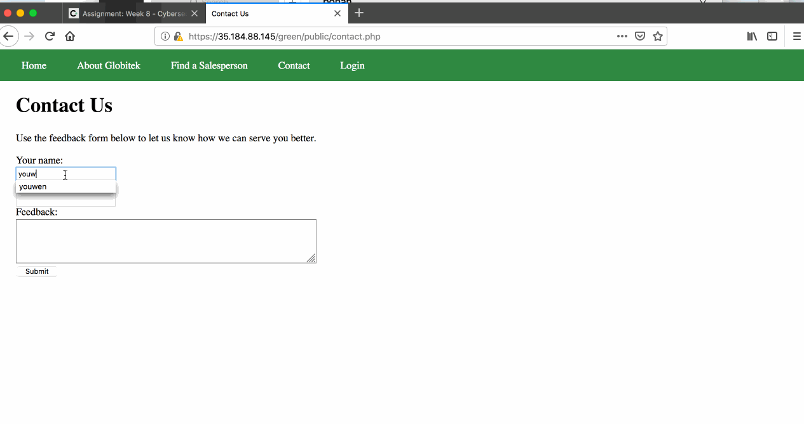
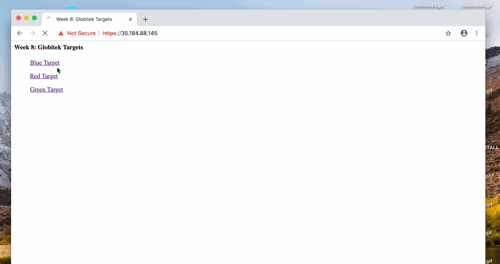
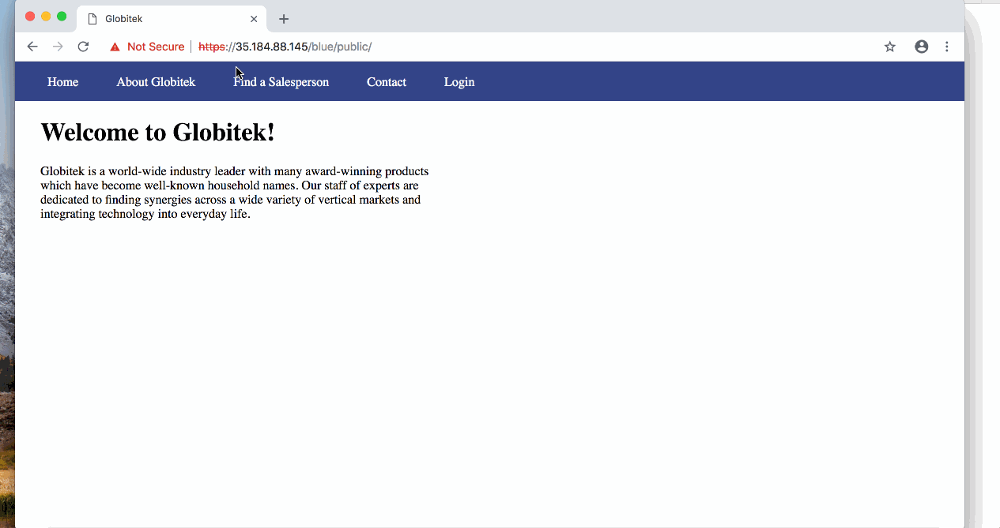
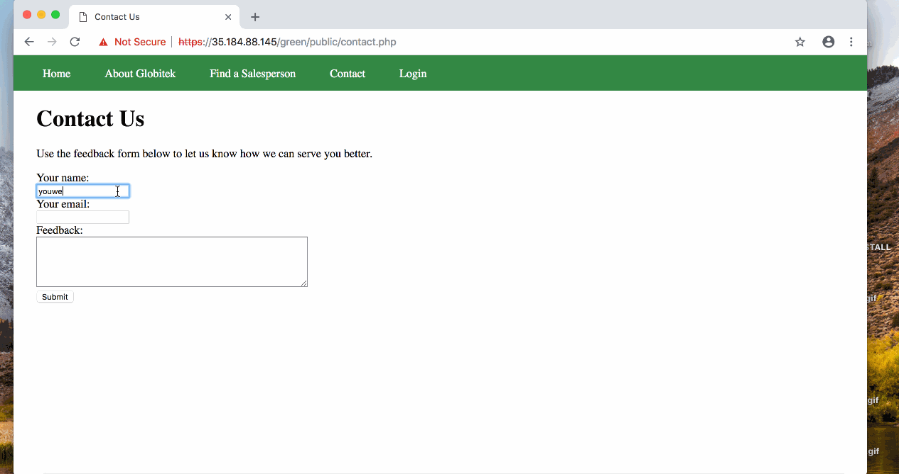

# Project 8 - Pentesting Live Targets

Time spent: **15** hours spent in total

> Objective: Identify vulnerabilities in three different versions of the Globitek website: blue, green, and red.

The six possible exploits are:
* Username Enumeration
* Insecure Direct Object Reference (IDOR)
* SQL Injection (SQLi)
* Cross-Site Scripting (XSS)
* Cross-Site Request Forgery (CSRF)
* Session Hijacking/Fixation

Each version of the site has been given two of the six vulnerabilities. (In other words, all six of the exploits should be assignable to one of the sites.)

## Blue

Vulnerability #1: SQL Injection



By clicking the Salesperson section, you will notice that there are "?id=X" at the end of the url. By entering a ?id=' OR 1=1'--, The blue section will show "Database query failed" while the green and red sections just redirect. This indicates that the blue section has SQLI vulnerability. 


Vulnerability #2: Session Hijacking/Fixation



Login to the blue Globitek website, using this ```public/hacktools/change_session_id.php``` to get the session id. And then open blue Globitek website without login in on another browser and set the session id to that session id, you will notice that the website on another browser is also logined without enter a account and a password.


## Green

Vulnerability #1: Username Enumeration



When I am trying login using a wrong username, the alert message is showed on browser. But when I am triyng to login using a correct username, the alert message showed is bold. By inspecting the page, we could found that class is "failture" for correct username. The other class is "failed" for uncorrect username.This may tells the hacker which user name is in the database, so green target has Username Enumeration Vulnerability.


Vulnerability #2: Cross-Site Scripting



In the Contact Us page, the script can be entered in Your Name, email and Feedback. For example, entering ```<script>alert('youwen found the XSS!')</script>``` into Feedback, submit it and in the login section, click the Feedback, the alert message created by others will pop up first and when their XSS are done, the alert message that I created will pop up.This indicates the XSS Vulnerability of green target.


## Red

Vulnerability #1: Insecure Direct Object Reference



In the Find a Salesperson section ```https://35.184.234.47/red/public/salesperson.php?id=X```, we can find peoples that are not in the given list by setting the id to the IDs that are not in the list.When I testify id=10 and id=11, the red target display the two salespersons that are not in the list, But in blue or green site, when you enter id=10 or id=11, then it will go back to Find a Salesperson page. So the the red target has IDOR Vulnerability.


Vulnerability #2: Cross-Site Request Forgery



When I trying to edit the information after changing the value of csrd_token, red section is still able to make a change, while the other two sections show "Error: invalid request" after I changed its csrd_token. Therefore, red target has CSRF Vulnerability.


## Bonus Objective 2: Build on Objective #4 (Cross-Site Scripting)



In green section, I enter this ```<script>document.location="https://www.google.com"</script>``` to Feedback in Contact Us, then go to the feedback section in Staff Menu, it direct switch to the page of google. Additionally, type ``` <script>alert(document.cookie)</script>``` may read the cookie data and type ``` <script>document.cookie="username=abcde"</script>```may set the cookie data.

## Notes

